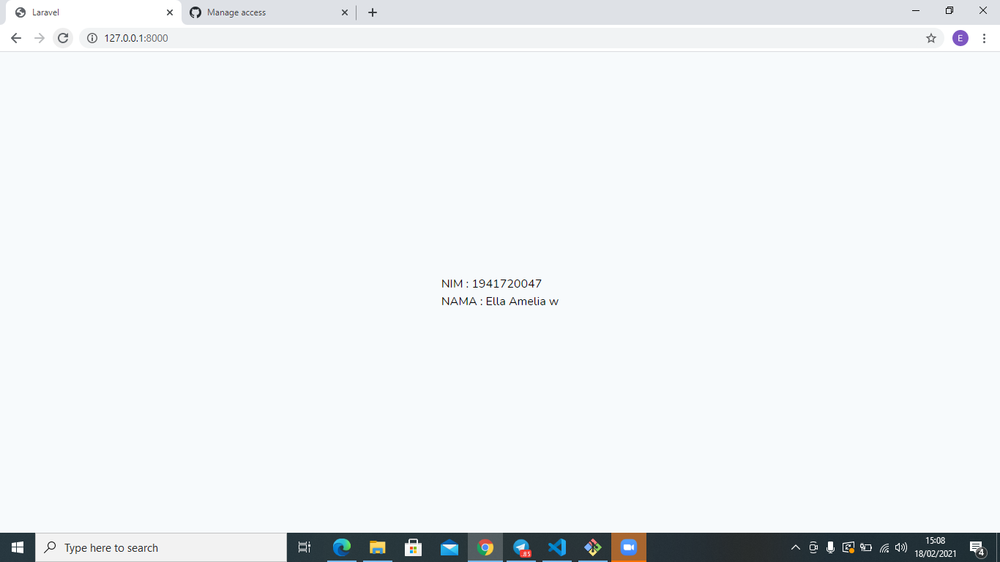

# 01 - Hello World

## Tujuan Pembelajaran

1. Mahasiswa mampu melakukan instalasi dan konfigurasi Laravel
2. Mahasiswa mampu mengubah tampilan welcome di Laravel

## Hasil Praktikum

[Kode Program](../../src/01_hello_world/welcome.blade.php)