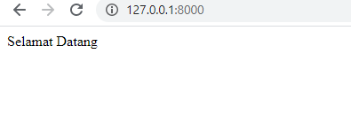
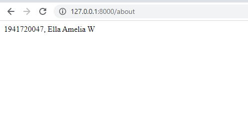
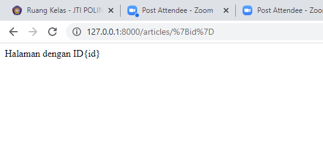
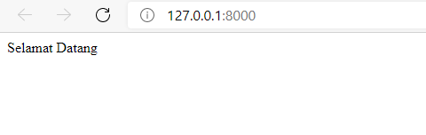
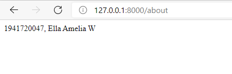
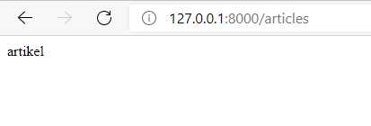

# 02 - Routing And Controller

## Tujuan Pembelajaran

1. Mahasiswa memahami konsep routing Web Framework
2. Mahasiswa menerapkan routing pada Web Framework
3. Mahasiswa memahami konsep controller
4. Mahasiswa menerapkan controller pada Web Framework
## Hasil Praktikum

### Praktikum 1

[Kode Program](../../src/02_RoutingController/Praktikum1/web.php)

### Praktikum 2

[Kode Program](../../src/02_RoutingController/Praktikum2/web.php)

[Kode Program](../../src/02_RoutingController/Praktikum2/PageController.php)

[Kode Program](../../src/02_RoutingController/Praktikum2/HomeController.php)

[Kode Program](../../src/02_RoutingController/Praktikum2/AboutController.php)

[Kode Program](../../src/02_RoutingController/Praktikum2/ArticlesController.php)

### Praktikum 3