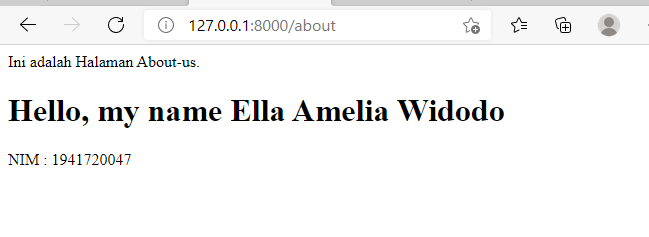
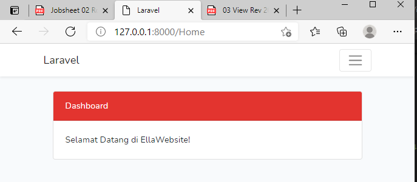
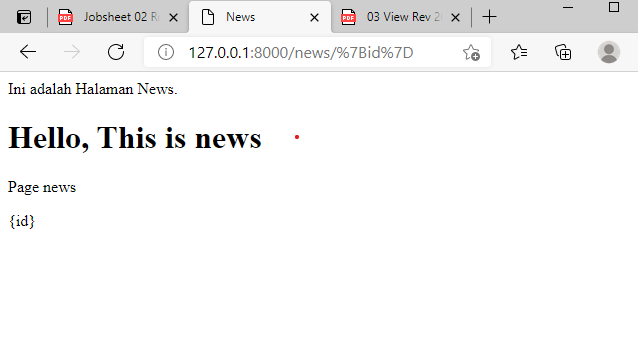
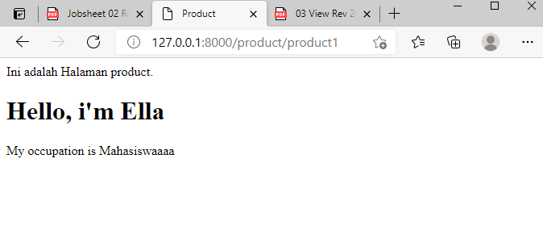

# 03-Views

## Tujuan Pembelajaran

1. Mahasiswa memahami konsep routing Lavarel Web Framework
2. Mahasiswa menerapkan routing pada Laravel web Framework
3. Mahasiswa mehamami konsep controller Laravel Web Framework
4. Mahasiswa menerapkan controller pada Laravel Web Framework
5. Mahasiswa memahami konsep views Laravel Web Framework
6. Mahasiswa menerapkan konsep views Laravel Web Framework

## Hasil Praktikum

### Praktikum 1

[Kode Program](../../cms/resources/views/home.blades.php)

[Kode Program](../../cms/resources/views/about.blades.php)

[Kode Program](../../cms/resources/views/program.blades.php)

[Kode Program](../../cms/resources/views/product.blades.php)

[Kode Program](../../cms/resources/views/news.blades.php)

[Kode Program](../../cms/resources/views/contact.blades.php)

