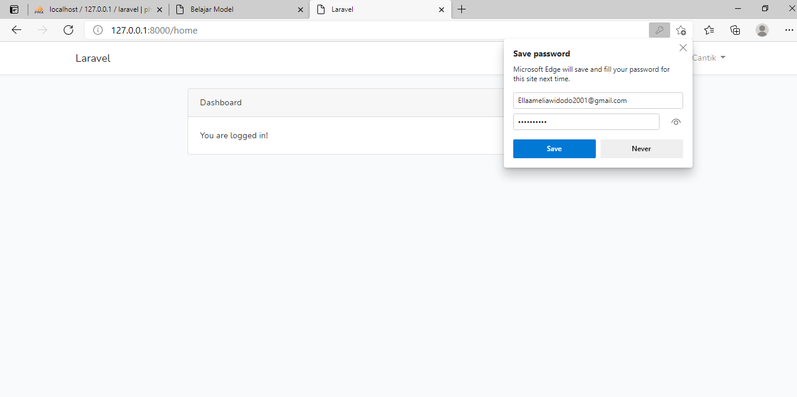
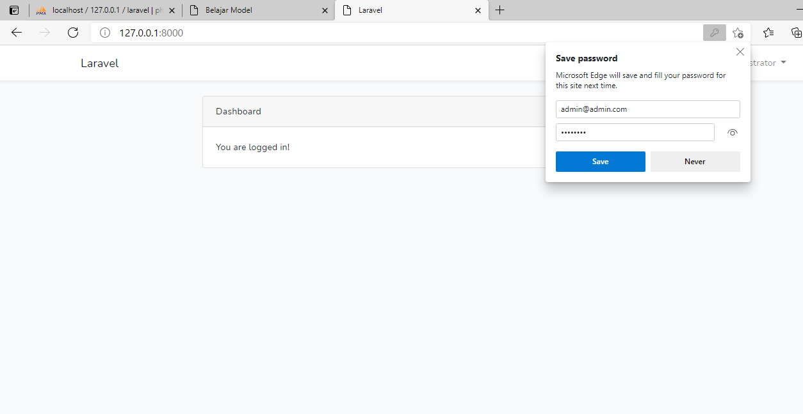
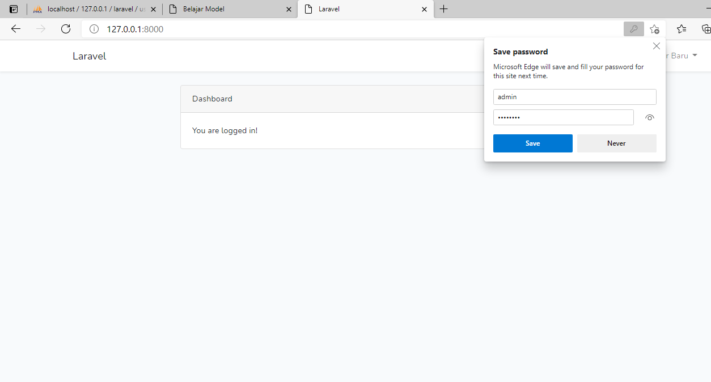
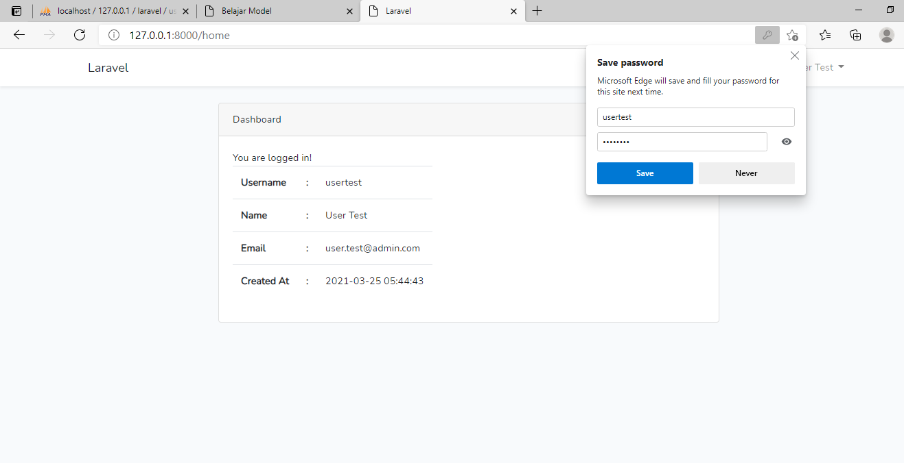

# 06-Autentikasi

## Tujuan Pembelajaran

1. Mahasiswa mampu memahami konsep authentication
2. Mahasiswa mampu membuat custom authentication

## Hasil Praktikum 

Praktikum 1

Praktikum 2

Praktikum 3

