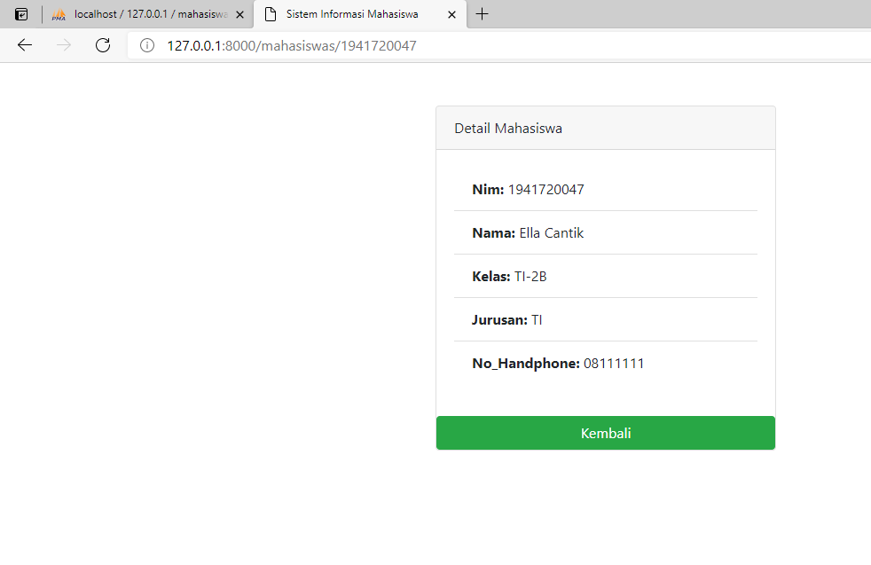

# 07-ORM ELOQUENT DAN CRUD

## Tujuan Pembelajaran

1. Mahasiswa mampu memahami konsep ORM
2. Mahasiswa mampu melakukan operasi CRUD dengan ORM

## Hasil Praktikum 

Praktikum 1

tugas 1

Praktikum 3

