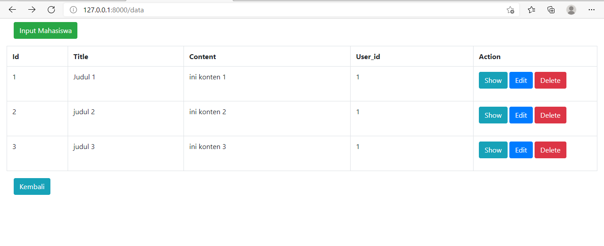

# 08 - UTS

## Tujuan Pembelajaran

1. Mahasiswa mampu menerapkan materi selama perkuliahan.

## Hasil UTS

SCREENSHOT

- Register
sebeleum melakukan login kita diharapkan melakukan register terlebih dahulu

- Login
lalu kita melakukan login

- Dashboard
lalu masuk ke menu home

- Edit Profil

- tabel 

- tabel 1 

- Edit data

- Show data

- delete data

CONTOH KODE PROGRAM  

[kode program](../../src/08_Uts/routes/view/web.php)

[kode program](../../src/08_Uts/layouts/app.blade.php)

[kode program](../../src/08_Uts/layouts/app2.blade.php)

