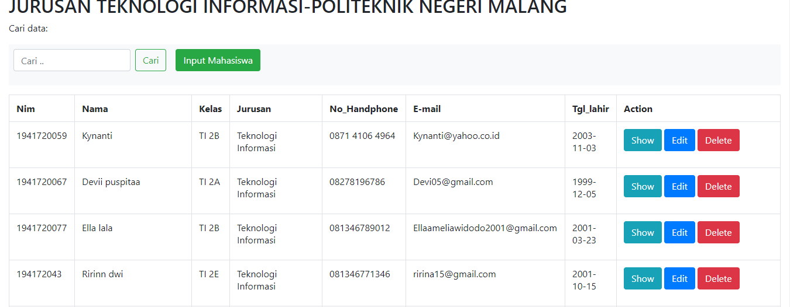
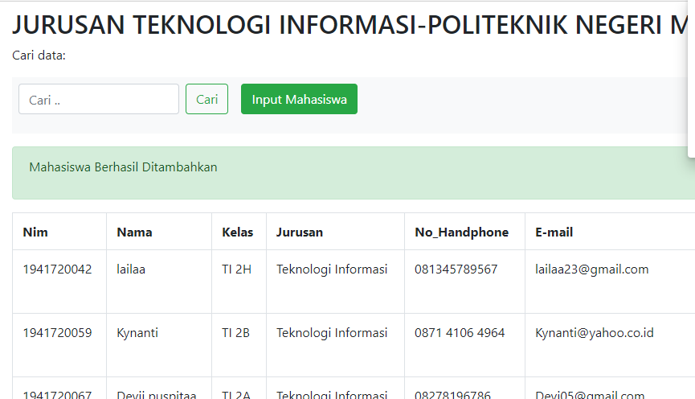
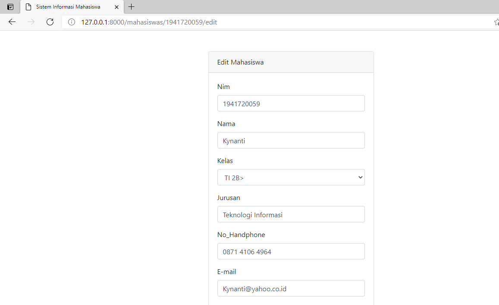
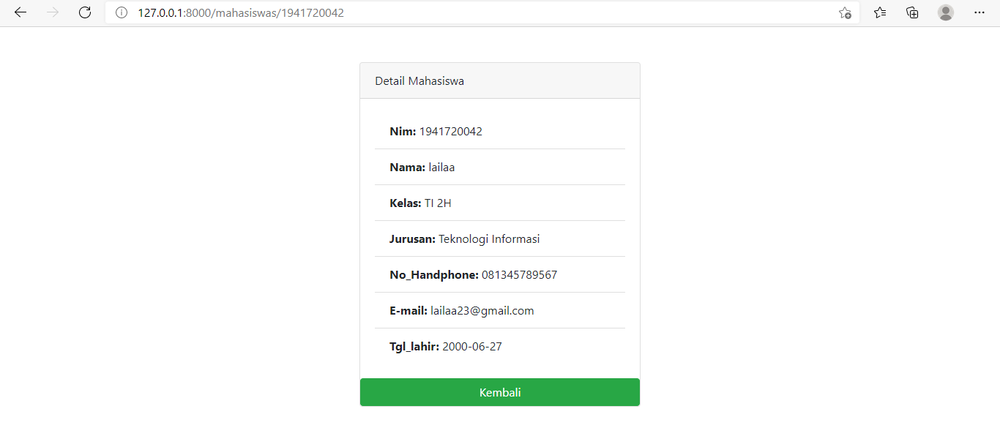
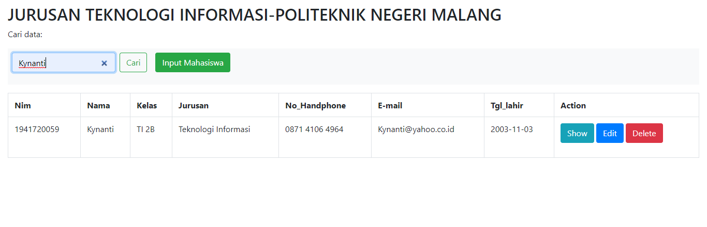
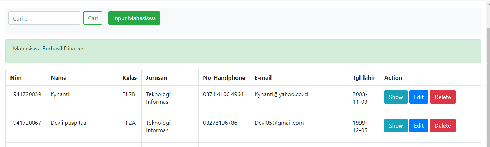

# 09_ORM dengan relasi

## Tujuan Pembelajaran

1. Mahasiswa mampu memahami konsep ORM dengan relasi authentication
2. Mahasiswa mampu mengimplementasikan ORM dengan relasi 

## Hasil Praktikum 1

SCREENSHOT

- Menampilkan halaman awal

- tampilan input data

- tampilan edit data

- tampilan show detail data

- tampilan cari data

- tampilan hapus data

