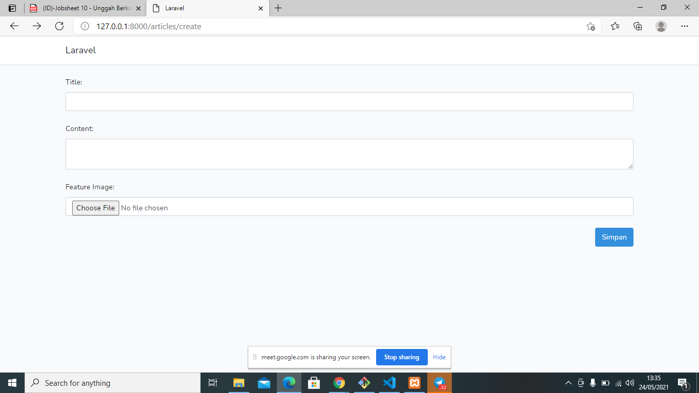
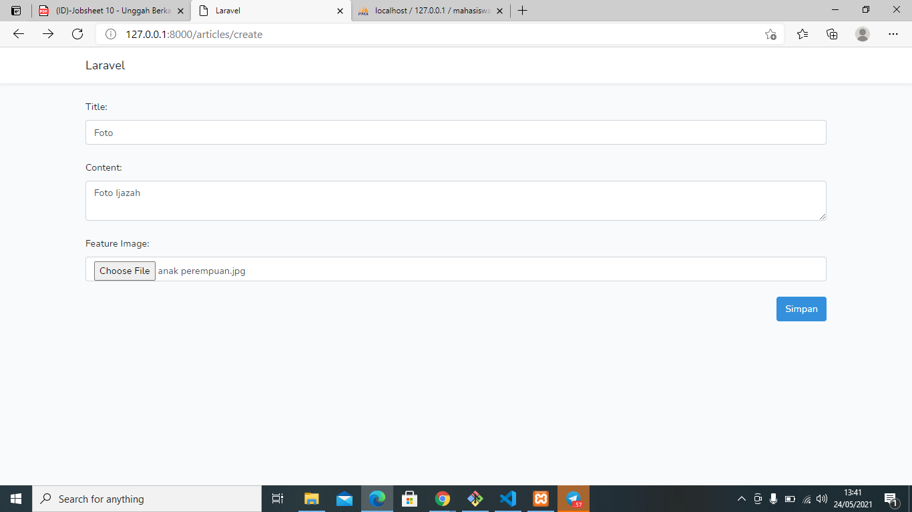
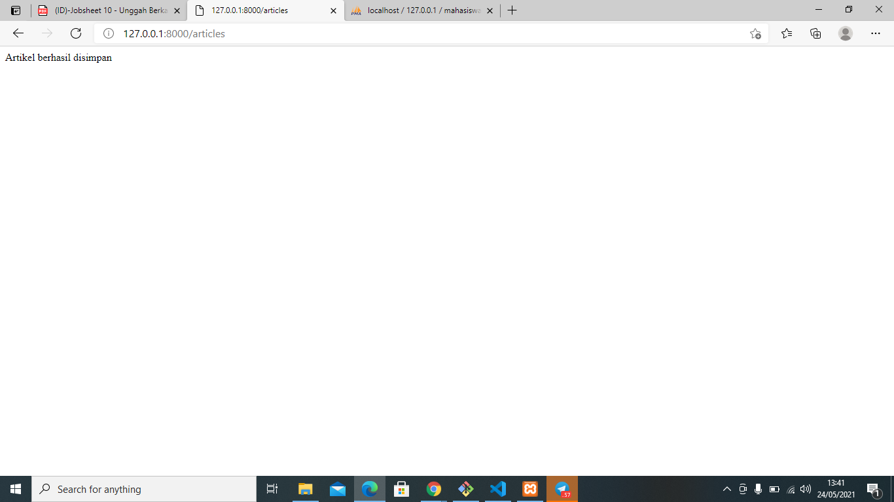
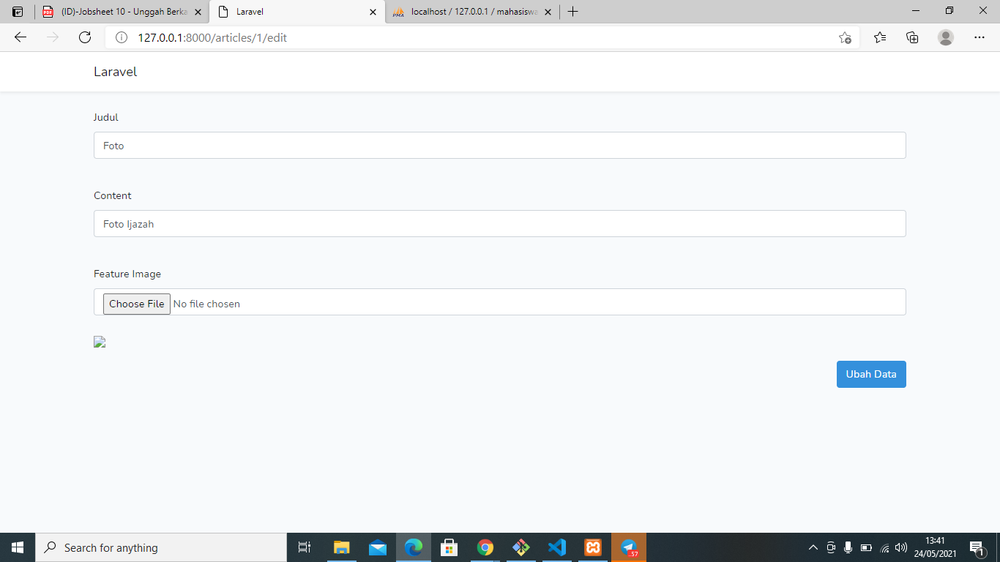
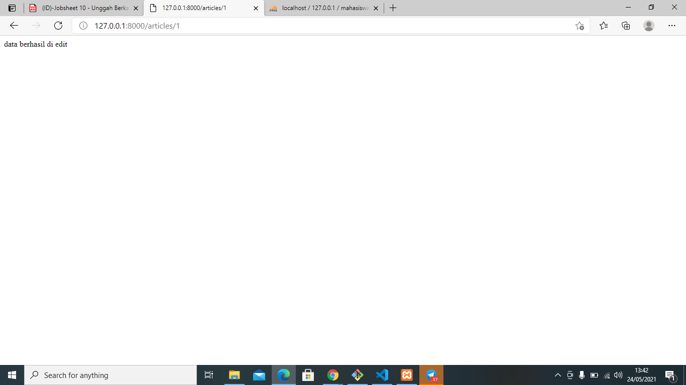
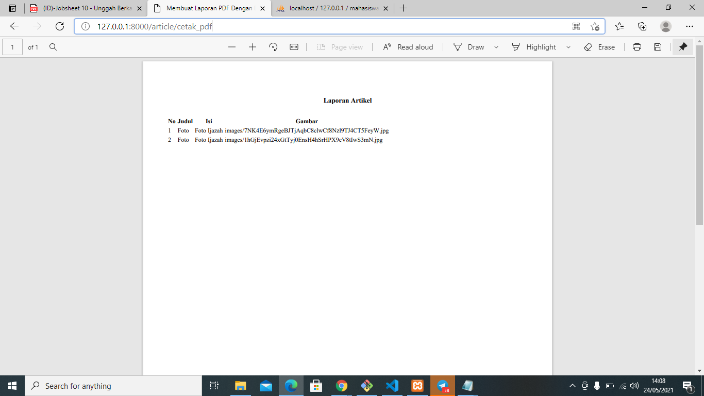
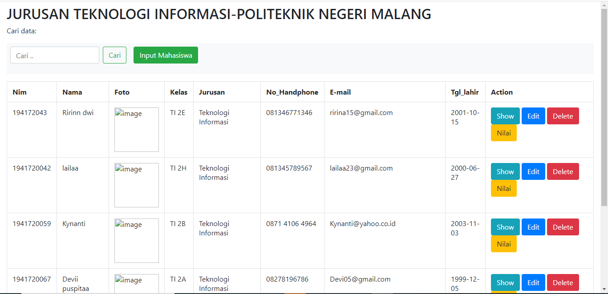

# 10_ExportBerkas

## Tujuan Pembelajaran

1. Mahasiswa mampu membuat fitur unggah file dengan Web Framework Laravel
2. Mahasiswa mampu membangun fitur pelaporan berupa export file PDF

## Hasil Praktikum 

SCREENSHOT

- Praktikum 1

-Praktikum 2

-Praktikum 3

-Tugas 1

Tambah tabel Foto

