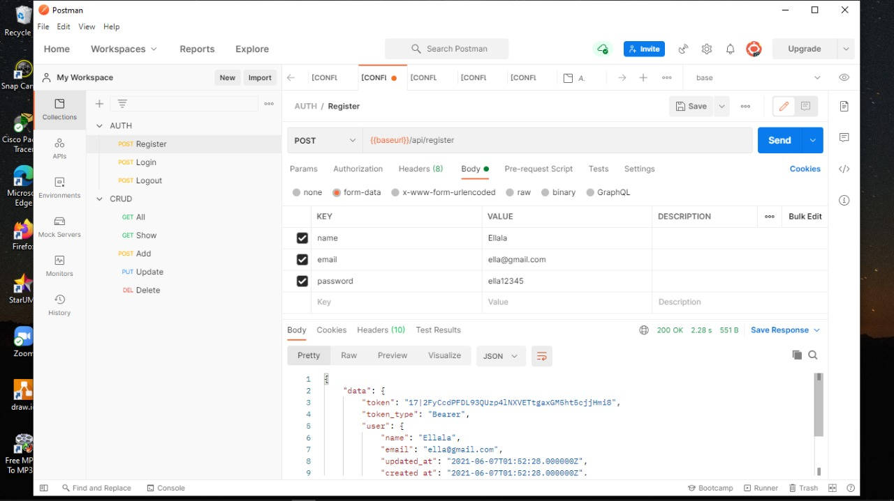
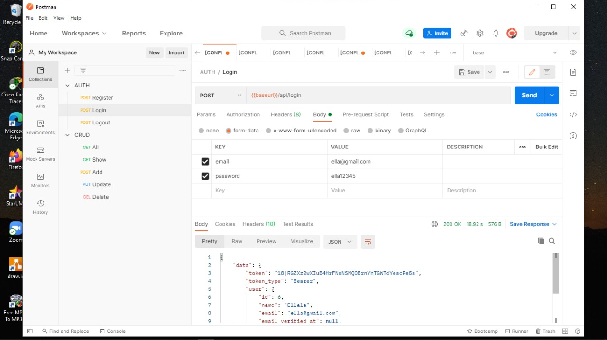
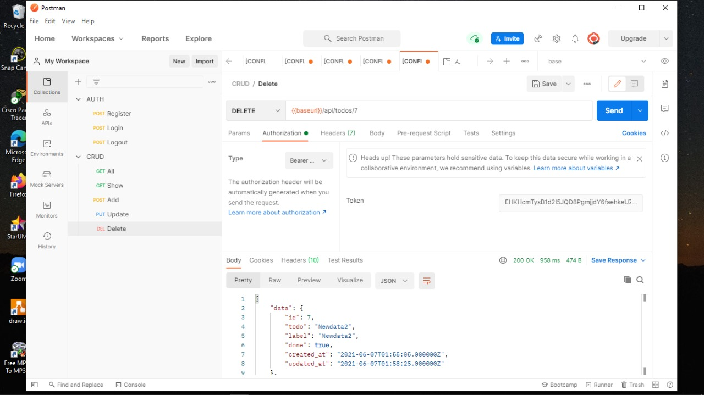
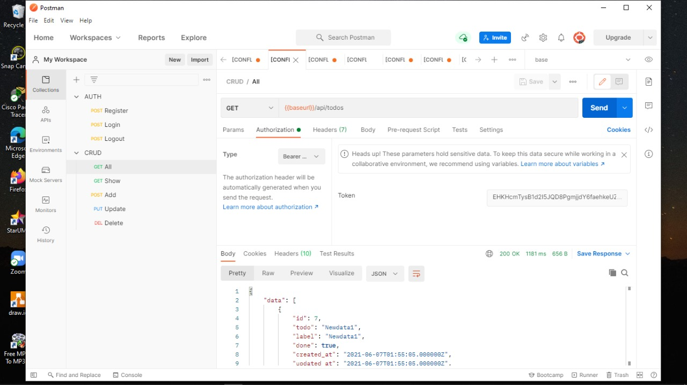

# 11_RESTful API

## Tujuan Pembelajaran

1. Mahasiswa memahami konsep RESTful API
2. Mahasiswa mampu membangun autentikasi token pada RESTful API
3. Mahasiswa mampu membangun CRUD dengan RESTful aPI

## Hasil Praktikum 

- Hasil Register

 
 - Hasil login

 

 - Hasil dari menu add

 

- Hasil dari delete

- Hasil dari all

- Hasil dari show

